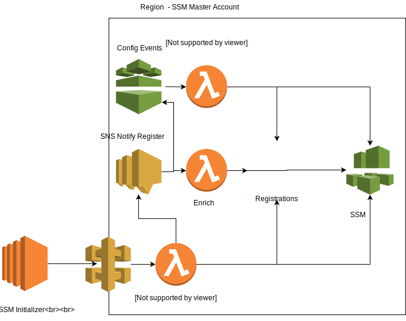

# OmniSSM

Automation for AWS Systems Manager using hybrid mode. Using hybrid mode for ec2 instances brings a few benefits.

 - No instance credentials needed
 - Centralized management of servers across numerous accounts.
 - Facilitate cross cloud/datacenter usage of SSM

Switching from ec2 to hybrid mode, does mean we have to reproduce a bit of functionality

 - Secure instance registration.
 - Instance deactivation/garbage collection on delete.
 - Instance metadata enrichment.

We provide a few bits of automation tooling to enable seamless hybrid mode.

 - A register api via api gw lambda for registering cloud instances.
   We handle secure introductions via cloud instance identity document signature verification.

 - a host registration/initialization cli for interacting with the register api and initializing ssm-agent on instance boot.

 - a custom inventory plugin for collecting process information.

 - a config subscriber for enriching a ssm instance with tags and cloud inventory,
   and deleting/gc instances from ssmo.

 - an sns topic subscriber for enriching instances that are registering after a config event
   has already fired (ie slow boot).

# Links

- Hybrid SSM Manual Install https://amzn.to/2Hlu9o2
- EC2 Instance Identity Documents https://amzn.to/2qLuGt9
- Google Instance Identity https://bit.ly/2HQexKc

# Todo

- scale testing
- test with large cfg messages
- sns subscriber for slow boot instances
- systemd timer example for initialize & inventory
- custom inventory output directly to agent pickup location
- osquery inventory example